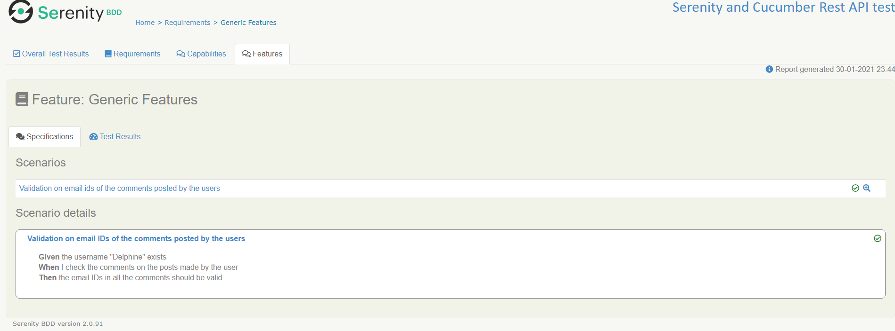
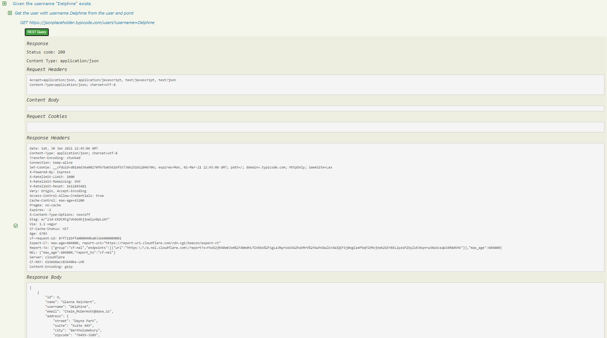

# Simple REST API testing with Serenity and Cucumber 6 on https://jsonplaceholder.typicode.com/

## Get the code

Git:

    git clone https://github.com/rvivek1989/serenity-rest.git
    cd serenity-rest

Or simply [download a zip](https://github.com/rvivek1989/serenity-rest/archive/main.zip) file.

## Living documentation

You can generate full Serenity reports by running `mvn clean verify`. 
This includes both the living documentation from the feature files:

And also details of the REST requests and responses that were executed during the test:

